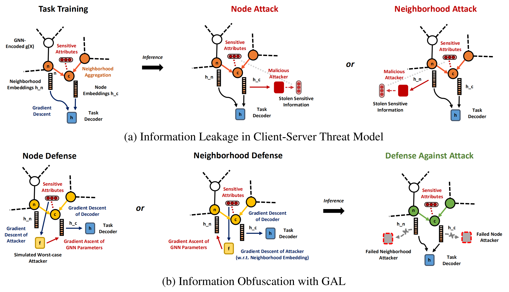
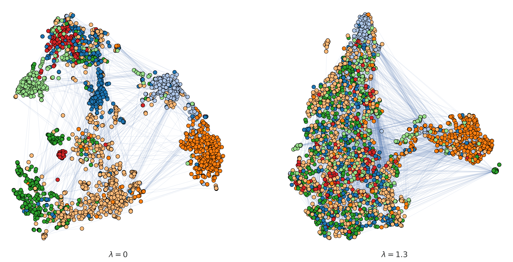
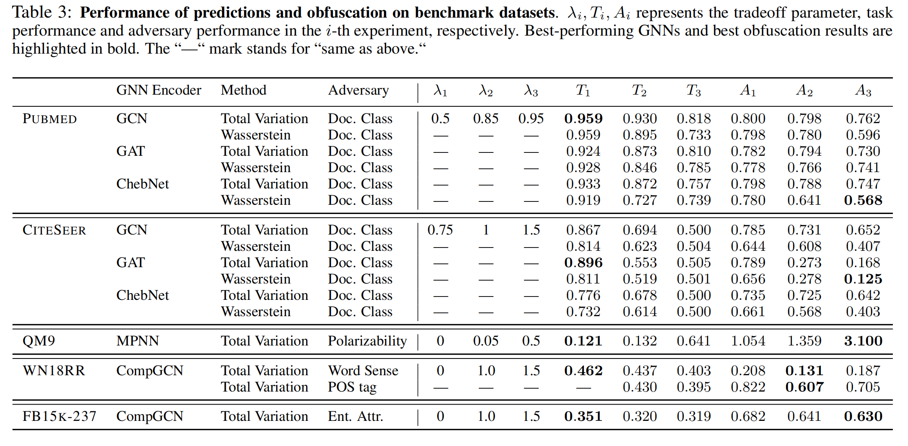

# Graph Adversarial Networks: Protecting Information against Adversarial Attacks

Peiyuan Liao*, Han Zhao*, Keyulu Xu*, Tommi Jaakkola, Geoffrey Gordon, Stefanie Jegelka,
Ruslan Salakhutdinov

\* Denotes equal contribution

This repository contains a PyTorch implementation of **G**raph **A**dversaria**L** Networks.

## Dependencies

 - Compatible with PyTorch 1.4.0 and Python 3.x
 - torch_geometric == 1.4.3 with newest packages specified below:

```
export CUDA=cu92/cu100/cu101/cpu
pip install torch-scatter==latest+${CUDA} -f https://pytorch-geometric.com/whl/torch-1.4.0.html
pip install torch-sparse==latest+${CUDA} -f https://pytorch-geometric.com/whl/torch-1.4.0.html
pip install torch-cluster==latest+${CUDA} -f https://pytorch-geometric.com/whl/torch-1.4.0.html
pip install torch-spline-conv==latest+${CUDA} -f https://pytorch-geometric.com/whl/torch-1.4.0.html
```

## Dataset

- We use FB15k-237 and WN18RR dataset for knowledge graph link prediction. 
- FB15k-237 and WN18RR are included in the `Freebase_Wordnet/data` directory. For `POS_tag` and `sense` attribute for WN18RR dataset, we took labels from [Bordes (2013)](https://www.hds.utc.fr/everest/doku.php?id=en:smemlj12), and for FB15k-237, we used entity-level tags from [Moon (2017)](https://github.com/cmoon2/knowledge_graph). Compressed data in `data_compressed` can be found in [repository of CompGCN](https://github.com/malllabiisc/CompGCN).
- We use Movielens-1M dataset for recommendation system link prediction task. You may access the data at [this link.](https://grouplens.org/datasets/movielens/1m/)

## Running

 - FB15k-237/WN18RR:
    - run `preprocess.sh` to unzip data
    - run `run.py -h` for arguments
    - re-run `run.py` with supplied arguments
    - results are reported in log
    
 - Movielens-1M:
    - create config file under config folder
    - run `exec.py --config_path=config`
    - results are reported in log

 - QM9/Planetoid
    - Run corresponding files under the `benchmarks` dataset

### Reproducing Results

 - FB15k-237/WN18RR:
    - Find `gen_sh.ipynb` under `config` folder
    - Execute the cells and replace path with appropriate path
    - Sequentially execute each generated shell script to obtain results under `log`

 - Movielens-1M:
    - Find `gen_json.ipynb` files under `config` folder
    - Execute the cells and replace path with appropriate path
    - Sequentially execute each generated json script to obtain results under `log`

 - QM9/Planetoid/Cora Visualization
    - Run corresponding files under the `benchmarks` dataset
    - For Cora Visualization, run `Cora_visualization.ipynb` under an interactive environment, and run all cells to obtain the desired results. (tweaking $$\lambda$$ values and the TSNE perplexity parameter will give different results)
    - Parameters are default values for both `planetoid_gal.py` and `qm9_gal.py`


## Our Algorithm and Model
The following figure gives a high-level illustration of our model, **G**raph **A**dversaria**L** Networks (GAL). GAL defends node and neighborhood inference attacks via a min-max game between the task decoder (blue) and a simulated worst-case attacker (yellow) on both the embedding (descent) and the attributes (ascent). Malicious attackers will have difficulties extracting sensitive attributes at inference time from GNN embeddings trained with our framework.


## Visualization of Learned Representations against Attacks
GAL effectively protects sensitive information. Both panels show t-SNE plots of the learned feature representations of a graph under different defense strengths. Node colors represent node classes of the sensitive attribute. The left panel corresponds to the learned representations with no-defense, while the right panel shows the representations learned by GAL. Note that without defense from GAL, the representations on the left panel exhibits a cluster structure of the sensitive attribute, make it easier for potential malicious attackers to infer. As a comparison, with GAL defense, nodes with different sensitive values are well mixed, making it hard for attackers to infer. 


## Results



## Citation

If you find the work useful in your research, please consider citing:

```
@misc{liao2020graph,
      title={Graph Adversarial Networks: Protecting Information against Adversarial Attacks}, 
      author={Peiyuan Liao and Han Zhao and Keyulu Xu and Tommi Jaakkola and Geoffrey Gordon and Stefanie Jegelka and Ruslan Salakhutdinov},
      year={2020},
      eprint={2009.13504},
      archivePrefix={arXiv},
      primaryClass={cs.LG}
}
```
